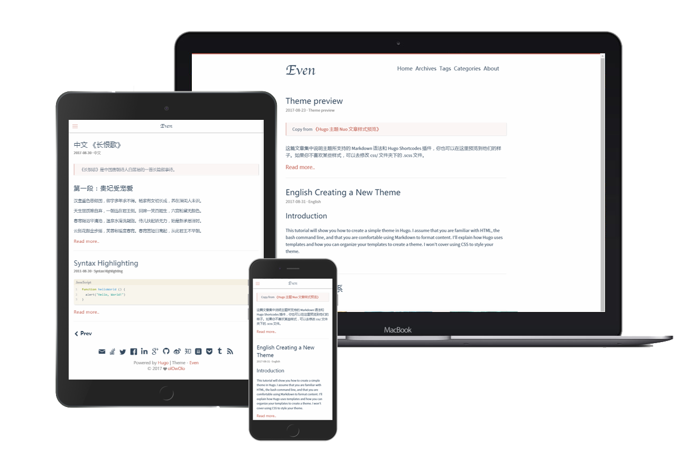

# hugo-theme-even

[](https://github.com/ouuan/hugo-theme-even/contributors)
[](https://github.com/ouuan/hugo-theme-even/blob/master/LICENSE.md)

A super concise theme for Hugo

> It's a port of the [hexo-theme-even](https://github.com/ahonn/hexo-theme-even)

[Demo](https://hugo-theme-even.netlify.app) | [中文说明](README-zh.md)

## Screenshots



## Installation

```bash
$ git clone https://github.com/ouuan/hugo-theme-even themes/even
```

If your blog is a git repository, you'd better use submodules:

```bash
git submodule add https://github.com/ouuan/hugo-theme-even themes/even
```

**Important:** Take a look inside the [`exampleSite`](exampleSite) folder of this theme. You'll find a file called [`config.toml`](exampleSite/config.toml). **To use it, copy the [`config.toml`](exampleSite/config.toml) in the root folder of your Hugo site.** Feel free to change it.

**Important:** This theme uses [Hugo Pipes](https://gohugo.io/hugo-pipes/introduction/). Modifying contents in `assets` requires the extended version to be installed.

**NOTE:** For this theme, you should use **post** instead of **posts**, namely `hugo new post/some-content.md`.

## Language Support

> Translations are collected from the [`themes/even/i18n/`](i18n) folder (built into the theme), as well as translations present in `i18n/` at the root of your project. The translations will be merged and take precedence over what is in the theme folder.

To use the translations, just set a correct value for [`defaultContentLanguage`](exampleSite/config.toml#L3).

```toml
defaultContentLanguage = "en"  # en / zh-cn / other...
```

Can also support any other languages as well. For example, to support german, create a file `/i18n/de.yaml` in the root folder of your Hugo site. For reference template you can see the [`en.yaml`](i18n/en.yaml) file.

P.S. In multilingual mode, the language which currently being used to render the website will be used.

## Favicon

In order to customize the favicon you need to place **all** the following files in the `static` folder at the root of your site.

- android-chrome-192x192.png
- android-chrome-512x512.png
- apple-touch-icon.png
- browserconfig.xml
- favicon.ico
- favicon-16x16.png
- favicon-32x32.png
- manifest.json
- mstile-150x150.png
- safari-pinned-tab.svg

A [favicon generator](https://www.google.com/search?q=favicon+generator) can help you generate these files.

## Front Matter

You can customize something for a single content in the content's front-matter. The [`themes/even/archetypes/default.md`](archetypes/default.md) shows all available params. Copy this file in the `archetypes` folder at the root of your project will be useful.

## Shortcodes

This theme provides `center`,` right`, `left`,` music`, `admonition` shortcodes, and support `center`,` right`, `left` class for the built-in `figure`. See more information [here](https://hugo-theme-even.netlify.app/post/shortcodes/).

## Theme Color

There are five built-in theme colors ( Default | Mint Green | Cobalt Blue | Hot Pink | Dark Violet ), you can config it by changing the `$theme-color-config` value in [`/assets/sass/_variable.scss`](assets/sass/_variables.scss#L8).

## Update Theme

```bash
cd themes/even
git pull
```

If you are using it as a submodule, you can also:

```bash
git submodule update --remote
```

## License

Released under the [MIT](LICENSE.md) License.

## Acknowledgements

- [ananke](https://github.com/budparr/gohugo-theme-ananke)
- [hexo-theme-even](https://github.com/ahonn/hexo-theme-even)
- [hugo-theme-even](https://github.com/olOwOlo/hugo-theme-even)
- [hugo-nuo](https://github.com/laozhu/hugo-nuo)
